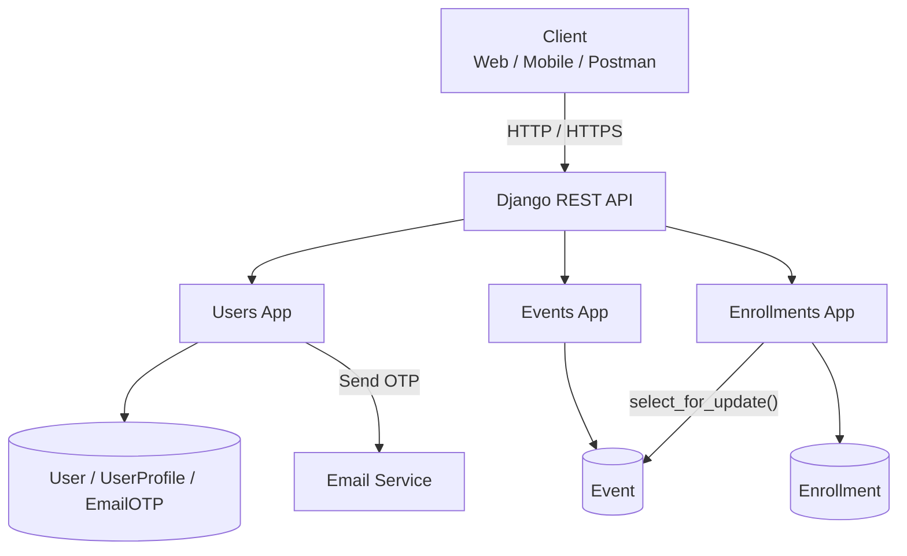

## ⚙️ Setup & Installation

### 1. Clone the Repository

```bash
git clone <repository-url>
cd events_platform
```

### 2.  Create and Activate a Virtual Environment

2.1) Windows (PowerShell):

```bash
python -m venv venv
venv\Scripts\activate
```
```bash
2.1) Linux / macOS:

python3 -m venv venv
source venv/bin/activate
```
```bash
### Install Dependencies
pip install -r requirements.txt
```
```bash
### Configure Environment Variables
Copy the example environment file:
```
```bash
### Windows (PowerShell):
Copy-Item .env.example .env
```

```bash
### Linux / macOS:
cp .env.example .env
```
```bash
### Run Database Migrations
python manage.py migrate
```
## Tech Stack
---

### Backend Framework & Libraries

| Component | Technology | Version | Purpose |
|-----------|------------|---------|---------|
| **Web Framework** | Django | 5.1.2 | Core web framework |
| **API Framework** | Django REST Framework | 3.15.2 | RESTful API endpoints |
| **Authentication** | djangorestframework-simplejwt | 5.3.1 | JWT authentication (access + refresh tokens) |
| **Database** | PostgreSQL (preferred) / SQLite (dev) | - | Data persistence; PostgreSQL recommended for production |
| **Email Backend** | Django Console Email | - | OTP delivery (development); production-ready providers can be swapped |

---

### Database & Hashing

| Component | Technology | Details |
|-----------|------------|---------|
| **ORM** | Django ORM | Built-in object-relational mapping |
| **Migrations** | Django Migrations | Version-controlled schema changes |
| **OTP Hashing** | Django `make_password()` | Uses **PBKDF2** with SHA-256 (default Django hasher) |
| **Password Hashing** | Django `make_password()` | Same PBKDF2+SHA-256 with 600,000 iterations (Django 5.1 default) |
| **Unique Constraint** | `UniqueConstraint` with `condition` | Partial unique index for re‑enrollment (PostgreSQL only) |

**OTP Storage:**  
- OTPs are **never stored in plaintext**.  
- Django’s `make_password()` hashes each OTP before saving to the database.  
- The hash includes a **salt** and uses the **PBKDF2** algorithm (default).  
- Plaintext OTPs only exist transiently in memory while being emailed; they are never logged or returned in API responses.

---

### Development & Testing

| Tool | Purpose |
|------|---------|
| **Python** 3.9+ | Runtime |
| **pip** | Package management |
| **venv** | Virtual environment |
| **Django Test Runner** | Automated testing |
| **unittest.mock** | Mocking email in tests |
| **Threading (Python)** | Concurrency simulation (Challenge A) |

---

### API & Communication

| Component | Technology |
|-----------|------------|
| **Authentication** | JWT (Bearer tokens) |
| **Serialization** | DRF Serializers |
| **Pagination** | DRF `PageNumberPagination` |
| **Permissions** | Custom DRF permission classes |
| **Error Format** | `{"detail": "...", "code": "..."}` |

---

### Deployment (Optional / Bonus)

| Component | Technology |
|-----------|------------|
| **Containerization** | Docker (bonus, not required) |
| **WSGI Server** | Gunicorn (for production) |
| **Web Server** | Nginx (recommended for production) |

---

### Security Measures

| Area | Implementation |
|------|----------------|
| **OTP Storage** | Hashed with PBKDF2 + salt (Django `make_password`) |
| **OTP Transmission** | Console email (dev), never in response body |
| **Authentication** | JWT with short‑lived access tokens (15 min) + refresh tokens |
| **Concurrency** | `select_for_update()` + `transaction.atomic()` |
| **Re‑enrollment** | Conditional unique constraint prevents duplicates |
| **Rate Limiting** | 30‑second cooldown on OTP resend |
| **Brute‑Force** | Max 5 OTP attempts before lockout |

---

### Summary of Key Libraries

```
# requirements.txt
Django==5.1.2
djangorestframework==3.15.2
djangorestframework-simplejwt==5.3.1
psycopg2-binary==2.9.9   # PostgreSQL adapter (if using PostgreSQL)
python-dotenv==1.0.1     # Environment variables
```

---

### Notes on Database Choice

- **PostgreSQL** is **preferred** for production because:
  - `select_for_update()` works reliably.
  - Conditional unique constraints (`UniqueConstraint` with `condition`) are fully supported.
  - Better performance with large datasets.
- **SQLite** is used in development for simplicity, but:
  - `select_for_update()` is ignored.
  - Conditional constraints fall back to application‑level enforcement (which is still correct but not as robust).

---


## Core API Endpoints

| Resource | Method | Endpoint | Allowed Roles |
|---|---|---|---|
| Signup | `POST` | `/api/users/signup/` | Public |
| Verify OTP | `POST` | `/api/users/verify-email/` | Public |
| Resend OTP | `POST` | `/api/users/resend-otp/` | Public |
| Login | `POST` | `/api/users/login/` | Public |
| Refresh Token | `POST` | `/api/token/refresh/` | Public |
| List Events | `GET` | `/api/events/` | Public |
| Create Event | `POST` | `/api/events/` | Facilitator only |
| Retrieve Event | `GET` | `/api/events/{id}/` | Public |
| Update Event | `PUT/PATCH` | `/api/events/{id}/` | Facilitator (Owner) |
| Delete Event | `DELETE` | `/api/events/{id}/` | Facilitator (Owner) |
| My Events | `GET` | `/api/events/my-events/` | Facilitator |
| Enroll | `POST` | `/api/enrollments/` | Seeker only |
| Cancel Enrollment | `DELETE` | `/api/enrollments/{id}/cancel/` | Seeker (Owner) |
| My Enrollments | `GET` | `/api/enrollments/my-enrollments/` | Seeker |


### 🚀 What I Would Improve With More Time
1) Full-Text Search — Use PostgreSQL SearchVector for faster and more relevant event discovery.
2) Redis Integration — Add caching for frequently accessed event listings and implement distributed rate limiting.
3) Production Email Delivery — Replace the development email backend with a provider such as SendGrid or AWS SES.
4) Real-Time Updates — Add WebSocket support for real-time event capacity and enrollment updates.
5) API Documentation — Add comprehensive Swagger/OpenAPI documentation for all endpoints.
6) Consistent Error Handling — Standardize validation and application errors across all API endpoints.
7) Production Docker Setup — Add Gunicorn, Nginx, SSL, and production-ready Docker configuration.
8) CI/CD Pipeline — Automate testing, linting, and deployment through a CI/CD pipeline.
9) Seed Data — Add fixtures or management commands to simplify local setup and demonstrations.


## Mandatory Documentation Files

| File | Content |
|---|---|
| `PROMPT_LOG.md` | AI prompts, tools/models used, what was used/changed/rejected, and at least 2 examples of AI-generated suggestions that were incorrect and corrected. |
| `DECISIONS.md` | At least 3 non-trivial engineering decisions, including the ambiguity, options considered, chosen approach, and trade-offs. |
| `DEBUGGING.md` | At least 2 real issues or failed assumptions, including the symptom, diagnosis, root cause, fix, and verification. |
| `README.md` | Project setup and run instructions, architecture overview, known limitations, and potential improvements. |
