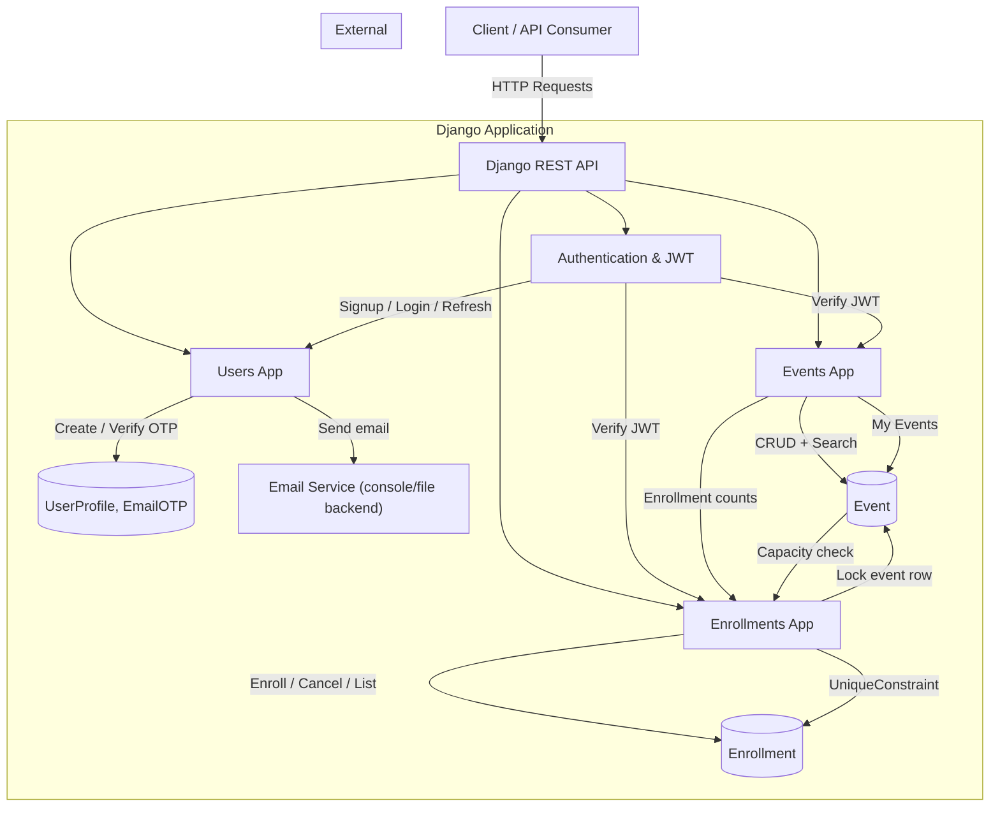

```mermaid
graph TD
    Client[Client / API Consumer] -->|HTTP Requests| API[Django REST API]

    subgraph "Django Application"
        API --> Auth[Authentication & JWT]
        API --> Users[Users App]
        API --> Events[Events App]
        API --> Enrollments[Enrollments App]

        Auth -->|Signup / Login / Refresh| Users
        Auth -->|Verify JWT| Events
        Auth -->|Verify JWT| Enrollments

        Users -->|Create / Verify OTP| UserDB[(UserProfile, EmailOTP)]
        Users -->|Send email| Email

        Events -->|CRUD + Search| EventDB[(Event)]
        Events -->|My Events| EventDB
        Events -->|Enrollment counts| Enrollments

        Enrollments -->|Enroll / Cancel / List| EnrollmentDB[(Enrollment)]
        Enrollments -->|Lock event row| EventDB
        Enrollments -->|UniqueConstraint| EnrollmentDB

        EventDB -->|Capacity check| Enrollments
    end

    subgraph External
        Email["Email Service (console/file backend)"]
    end
```