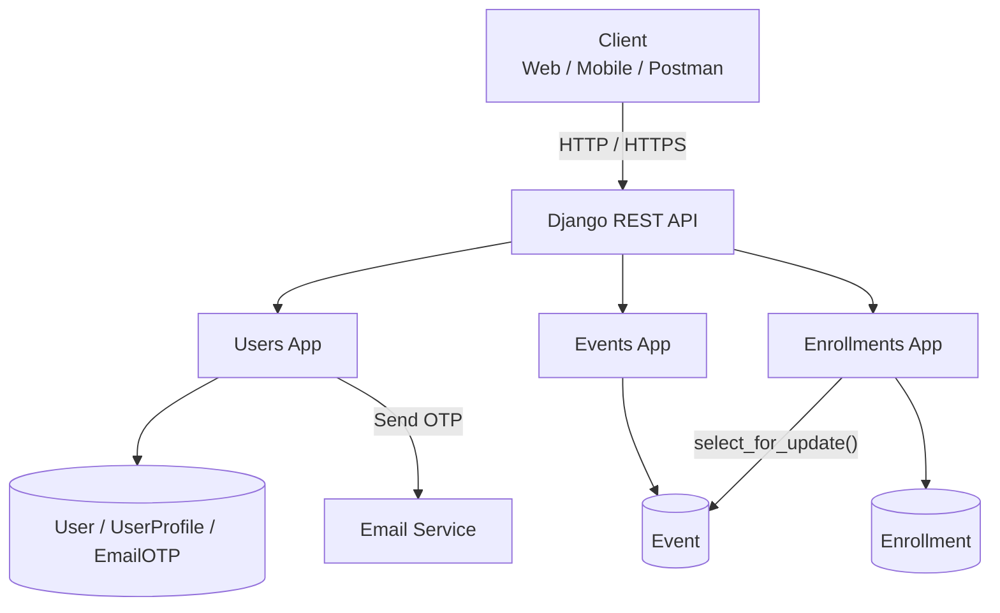

## ⚙️ Setup & Installation

### 1. Clone the Repository

```bash
git clone <repository-url>
cd events_platform
```

### 2.  Create and Activate a Virtual Environment

2.1) Windows (PowerShell):

```bash
python -m venv venv
venv\Scripts\activate
```
```bash
2.1) Linux / macOS:

python3 -m venv venv
source venv/bin/activate
```
```bash
### Install Dependencies
pip install -r requirements.txt
```
```bash
### Configure Environment Variables
Copy the example environment file:
```
```bash
### Windows (PowerShell):
Copy-Item .env.example .env
```

```bash
### Linux / macOS:
cp .env.example .env
```
```bash
### Run Database Migrations
python manage.py migrate
```


## Core API Endpoints

| Resource | Method | Endpoint | Allowed Roles |
|---|---|---|---|
| Signup | `POST` | `/api/users/signup/` | Public |
| Verify OTP | `POST` | `/api/users/verify-email/` | Public |
| Resend OTP | `POST` | `/api/users/resend-otp/` | Public |
| Login | `POST` | `/api/users/login/` | Public |
| Refresh Token | `POST` | `/api/token/refresh/` | Public |
| List Events | `GET` | `/api/events/` | Public |
| Create Event | `POST` | `/api/events/` | Facilitator only |
| Retrieve Event | `GET` | `/api/events/{id}/` | Public |
| Update Event | `PUT/PATCH` | `/api/events/{id}/` | Facilitator (Owner) |
| Delete Event | `DELETE` | `/api/events/{id}/` | Facilitator (Owner) |
| My Events | `GET` | `/api/events/my-events/` | Facilitator |
| Enroll | `POST` | `/api/enrollments/` | Seeker only |
| Cancel Enrollment | `DELETE` | `/api/enrollments/{id}/cancel/` | Seeker (Owner) |
| My Enrollments | `GET` | `/api/enrollments/my-enrollments/` | Seeker |


### 🚀 What I Would Improve With More Time
1) Full-Text Search — Use PostgreSQL SearchVector for faster and more relevant event discovery.
2) Redis Integration — Add caching for frequently accessed event listings and implement distributed rate limiting.
3) Production Email Delivery — Replace the development email backend with a provider such as SendGrid or AWS SES.
4) Real-Time Updates — Add WebSocket support for real-time event capacity and enrollment updates.
5) API Documentation — Add comprehensive Swagger/OpenAPI documentation for all endpoints.
6) Consistent Error Handling — Standardize validation and application errors across all API endpoints.
7) Production Docker Setup — Add Gunicorn, Nginx, SSL, and production-ready Docker configuration.
8) CI/CD Pipeline — Automate testing, linting, and deployment through a CI/CD pipeline.
9) Seed Data — Add fixtures or management commands to simplify local setup and demonstrations.


## Mandatory Documentation Files

| File | Content |
|---|---|
| `PROMPT_LOG.md` | AI prompts, tools/models used, what was used/changed/rejected, and at least 2 examples of AI-generated suggestions that were incorrect and corrected. |
| `DECISIONS.md` | At least 3 non-trivial engineering decisions, including the ambiguity, options considered, chosen approach, and trade-offs. |
| `DEBUGGING.md` | At least 2 real issues or failed assumptions, including the symptom, diagnosis, root cause, fix, and verification. |
| `README.md` | Project setup and run instructions, architecture overview, known limitations, and potential improvements. |